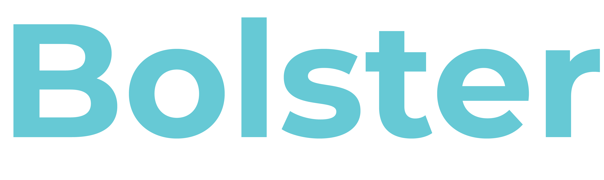

<div style="text-align:center"></div>

# BolsterJS

> Microfrontend Experiences

A lateral nanoframework that faciliates best practices and conventions for integrating Microfrontend Experiences together.

`BolsterJS` nanoframework provides an API library for integrating Microfrontend Experiences together and a CLI tool for rapidly scaffolding Microfrontend Experiences with the `BolsterJS` library already setup.

## Terms

* **Container** - a host app that manages multiple Microfrontend Experiences
* **Experience** - a Microfrontend app that implements a user journey

## Peer Dependencies

The library relies on the parent dependant to have the following installed:

* `react` (17+)
* `react-router-dom` (v5+)
* `history` (v4.9.0) (Shipped with react-router-dom)

The library is built to work with WebPack Module Federation.

## API

The default export is a function, referred to as `bolster`.
Other documented APIs are named exports.

### `bolster(import('my-app/experience'))` => LazyReactComponent

The main exported function accepts a promise that must resolve to a dynamic import object
(e.g. the result of calling the dynamic `import` function).

When the component is instantiated, any props passed form the basis for application state
between the Container and the Experience which can be retrieved in any component within any
given experience with the [`useBolster` hook](#usebolster--state), the [`withBolster` HOC](#withbolstercomponent--higherorderreactcomponent),
the [`BolsterConsumer`](#bolsterconsumer--reactcomponent) or using the [`getBolsterContextType` function](#getbolstercontexttype--reactcontext) 
to retrieve the necessary context object for setting a `contextType` static on a React Class Component.

When called, the `bolster` function returns a [Lazy React Component](https://reactjs.org/docs/code-splitting.html#reactlazy) which **MUST** be used within a `React.Suspense` component which in turn **MUST** be within 
a [React Router](https://reactrouter.com/) component.

```js
import React, { Suspense } from 'react'
import { Router, Route, Switch, Redirect } from 'react-router-dom'
import { createBrowserHistory } from 'history'
import bolster from '@mobilelive-inc/bolsterjs'
const history = createBrowserHistory()
const HomeExperience = bolster(import('home/experience'))
const BookingExperience = bolster(import('booking/experience'))

export default () => {
  <Router history={history}>
    <Suspense>
      <Switch>
        <Route path='/'>
          <HomeExperience/>
        </Route>
        <Route path='/booking'>
          <BookingExperience  any="props" are={()=> 'app state'}/>
        </Route>
      </Switch>
    </Suspense>
  </Router>
}
```

### `experience(RootComponent, renderFunction, [<StandaloneExperience/>], [history object])`

The result of `experience` should be the default export of the endpoint
exposed by the `ModuleFederationPlugin` in a WebPack configuration file. 

Given a WebPack config file like the following:

```js
const { merge } = require('webpack-merge')
const HtmlWebpackPlugin = require('html-webpack-plugin')
const ModuleFederationPlugin = require('webpack/lib/container/ModuleFederationPlugin')
const packageJson = require('../package.json')
const commonConfig = require('./webpack.common')

const devConfig = {
  mode: 'development',
  output: {
    publicPath: 'http://localhost:8082/'
  },
  devServer: {
    port: 8082,
    historyApiFallback: {
      index: '/index.html'
    }
  },
  plugins: [
    new ModuleFederationPlugin({
      name: 'auth',
      filename: 'remoteEntry.js',
      exposes: {
        './experience': './src/bootstrap'
      },
      shared: packageJson.dependencies
    }),
    new HtmlWebpackPlugin({
      template: './public/index.html'
    })
  ]
}

module.exports = merge(commonConfig, devConfig)
```

The `./src/bootstrap.js` file can use `experience` as follows:

```js
import ReactDOM from 'react-dom'
import App from './App'
import { experience } from '@mobilelive-inc/bolsterjs'

export default experience(App, ReactDOM.render)
```


### `<StandaloneExperience/>` => ReactComponent

The `<StandaloneExperience>` component is purely a development/preview feature and is therefore
optional. It can be used to define dummy state that the container would be expected to pass to
the experience so that when the Microfrontend Experience is executed in standalone mode. This should
only every be passed to the `experience` function.

```js
import React from 'react'
import ReactDOM from 'react-dom'
import App from './App'
import { experience } from '@mobilelive-inc/bolsterjs'

export default experience(
  App, 
  ReactDOM.render,
  <StandaloneExperience some="dummy" state="that the experience expects the container to usually provide">
)
```

When any Microfrontend Experience is viewed in standalone mode, `bolster` expects an element with id `#dev-preview`
that it can automatically mount to.

### `useBolster()` => state

The `useBolster` hook can be called in any functional component in an Experience, and it will return the Container level state for that Experience, and only for that Experience. By design, state in other Experiences cannot be accessed directly.

This state is set by passing props when initializing the Experience. State can be communicated back up to the Container
application by setting props to functions that when called, update the application level state.

Given an experience that was initialized like so:

```js
// THIS IS IN THE CONTAINER APP
<SomeExperience changeUser={(user) => setUserState(user)}>
```

The `setUserState` function is imaginary, let's pretend it's a `setState` function from a `useState` hook. 

In any component within the hypothetical `Some` MicroFrontend Experience app, a state change can be triggered
in the parent Container app like so:

```js
// THIS IS A COMPONENT IN AN EXPERIENCE APP
export default function MyComponent () {
  const { changeUser } = useBolster()
  return <div><button onClick={() => changeUser('Bob')}>Set user to Bob</button></div>
}
```

### `withBolster(Component)` => HigherOrderReactComponent

The `withBolster` Higher Order Component creator function can be wrapped around any React component and to map
Container level state for that Experience (and only for that Experience) to the props of the component it 
has wrapped.

This state is set by passing props when initializing the Experience. State can be communicated back up to the Container
application by setting props to functions that when called, update the application level state.

Given an experience that was initialized like so:

```js
// THIS IS IN THE CONTAINER APP
<SomeExperience changeUser={(user) => setUserState(user)}>
```

The `setUserState` function is imaginary, let's pretend it's a `setState` function from a `useState` hook. 

In any component within the hypothetical `Some` MicroFrontend Experience app, a state change can be triggered
in the parent Container app like so:

```js
// THIS IS A COMPONENT IN AN EXPERIENCE APP
export default withBolster(function MyComponent ({ changeUser }) {
  return <div><button onClick={() => changeUser('Bob')}>Set user to Bob</button></div>
})
```

This can also be used with Class-based components:

```js
// THIS IS A COMPONENT IN AN EXPERIENCE APP
export default withBolster(class MyClassComponent {
  static contextType = getBolsterContextType()
  render () {
    const { changeUser } = this.props
    return <div><button onClick={() => changeUser('Bob')}>Set user to Bob</button></div>
  }
})
```

### `getBolsterContextType()` => ReactContext

This is the least advised way to pull application state into a React component. It can assigned to `contextType`
property of a React Component Class.
```js
// THIS IS IN THE CONTAINER APP
<SomeExperience changeUser={(user) => setUserState(user)}>
```

The `setUserState` function is imaginary, let's pretend it's a `setState` function from a `useState` hook. 

In any component within the hypothetical `Some` MicroFrontend Experience app, a state change can be triggered
in the parent Container app like so:

```js
// THIS IS A COMPONENT IN AN EXPERIENCE APP
export default class MyClassComponent {
  static contextType = getBolsterContextType()
  render () {
    const { changeUser } = this.context
    return <div><button onClick={() => changeUser('Bob')}>Set user to Bob</button></div>
  }
}
```

### `<BolsterConsumer/>` => ReactComponent

A [context consumer](https://reactjs.org/docs/context.html#contextconsumer) which can be used to get the application state for that a given Experience.

```js
// THIS IS IN THE CONTAINER APP
<SomeExperience changeUser={(user) => setUserState(user)}>
```

```js
// THIS IS A COMPONENT IN AN EXPERIENCE APP
export default function MyComponent () {
  return <BolsterConsumer>{({ changeUser }) => <button onClick={() => changeUser('Bob')}>Set user to Bob</button>}</BolsterConsumer>
})
```

This can also be used with Class-based components:

```js
// THIS IS A COMPONENT IN AN EXPERIENCE APP
export default class MyClassComponent {
  render () {
    return <BolsterConsumer>{({ changeUser }) => <button onClick={() => changeUser('Bob')}>Set user to Bob</button>}</BolsterConsumer>
  }
})
```

### `<BolsterProvider/>` => ReactComponent

Advanced use only. This is used internally by the `experience` function to assign Experience-specific application state to a given Experience. When handrolling the bootstrapping of an Experience the `BolsterProvider` would be needed to re-implement this same functionality.


### `bolster.wrap(import('my-non-react-app/experience')) => LazyReactComponent`

The `bolster.wrap` function can be used to mount any-non React Microfrontend Experience into a Container application.

Non-React Microfrontend Experiences can not use the [`experience`](#experiencerootcomponent-renderfunction-standaloneexperience) function for the bootstrapping
entrypoint. They must instead export a `mount` function. 

The exported `mount` function will be passed two arguments: the DOM element to mount at, and a props object
for any props specified on the `LazyReactComponent` returned from `bolster.wrap`.

The following is an example `./src/bootstrap.js` file from a Vue-based Microfrontend Experience:

```js
import { createApp } from 'vue'
import ProtectedDash from './components/ProtectedDash.vue'

export const mount = (el, props) => {
  // not doing anything with props in this case
  const app = createApp(ProtectedDash)
  app.mount(el)
}

if (process.env.NODE_ENV === 'development') {
  const devRoot = document.querySelector('#dev-preview')

  if (devRoot) {
    mount(devRoot)
  }
}
```

## CLI

`BolsterJS` exposes a binary that allows any user to generate a __Micro FrontEnd Experience__ or __Micro FrontEnd Container__ initial skeleton.

In order to generate an initial project initialize the `bolster` binary with the arguments `create` and the name of your project.

```sh
npx @mobilelive-inc/bolster create <name of project>
```

You can also install `@mobilelive-inc/bolster` in your global `node_modules` and execute `bolster create <name of project>`.

Once a project has being generated simply follow the instructions on your command line, and start creating your micro frontend application.